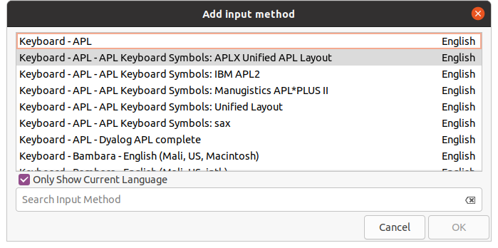

---  
htmel:  
    toc: true  
    number_sections: true  
    toc_depth: 6  
    toc_float: true  
    collapsed: true  
    smooth_scroll: true  
---
<!-- @import "[TOC]" {cmd="toc" depthFrom=1 depthTo=6 orderedList=false} -->
# 在linux环境下安装搜狗输入法  
## 官方教程  
[搜狗输入法官方教程](https://shurufa.sogou.com/linux/guide)  
## 遇到的问题及解决方法  
- 重启后仍然没有搜狗输入法  
如下图所示，需要把“only show current Lauguage”取消勾选，然后在搜索框内找到搜狗，并应用。  
  
- 搜狗输入法无法输入中文  
在~/.bashrc中加入如下的代码。  
`export GTK_IM_MODULE=fcitx`  
`export QT_IM_MODULE=fcitx`  
`export XMODIFIERS="@im=fcitx"`